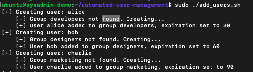
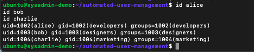
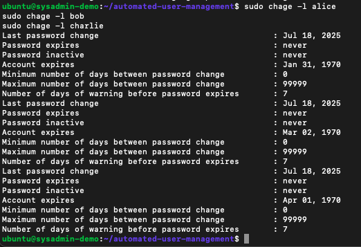
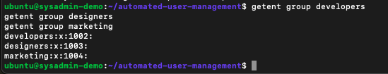

# Automated User Management Script

This project automates the process of creating users and assigning them to groups on a Linux system using data from a CSV file. It's designed to streamline onboarding and improve consistency for SysAdmins working in cloud-hosted environments like AWS EC2.

---

## Project Structure

- `add_users.sh` – Main user creation script  
- `user.csv` – Sample user input file  
- `users.csv` – Testing version of input file  
- `logs/` – Folder containing output logs  
- `docs/screenshots/` – Folder containing process screenshots  
- `README.md` – Project documentation  

---

## Prerequisites

Before you begin, you’ll need:

- An Ubuntu-based system (this was tested on an AWS EC2 instance)  
- Bash shell  
- Sudo privileges  

---

## CSV Format

The script reads from a CSV file with the following columns:

`username,group,expiry_days`

**Example input:**

alice,developers,30  
bob,designers,60  
charlie,marketing,90  

---

## Process Walkthrough

### Step 1: Clone the Repository

Clone this project from GitHub and navigate into the project directory.

### Step 2: Edit the CSV File

Open `user.csv` and input the users you want to create.  
Make sure the format matches the example above.

### Step 3: Run the Script

Make the script executable and run it using `sudo`.  
This script will:

- Check if the user exists  
- Create the user if they don’t exist  
- Create the group if it doesn’t exist  
- Add the user to the group  
- Set the account expiration date  

### Step 4: Verify the Users

Check `/etc/passwd` to confirm the users were created.  

### Step 5: Confirm Expiry Dates

Use the `chage` command to view each user’s expiration setting.  

### Step 6: Verify Groups

Ensure the specified groups were created correctly.  

---

## Logs

Each time the script is run, output is logged to a file inside the `logs/` directory. These logs include confirmation messages, errors, and timestamped details.

---

## Future Enhancements

This project could be expanded with:

- Pulling users from a shared network file or database  
- Automatically syncing with a cron job  
- Sending email alerts after successful creation  
- Writing to a central log server or dashboard  

---

### Author
Sydnie Pittman
2025
